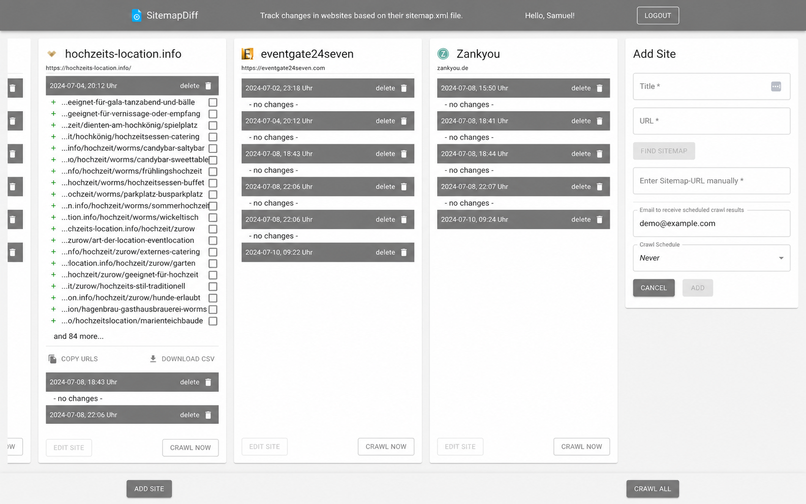

# SitemapDiff

**SitemapDiff macht Änderungen an Websites über ihre Sitemap nachvollziehbar.**

[Live-Demo](https://sitemapdiff8.fly.dev/) · Spring Boot · React · TypeScript · MongoDB · Docker



## Problem

Teams verlieren Änderungen auf relevanten Websites aus dem Blick.

## Lösung

SitemapDiff crawlt Sitemaps, erkennt Unterschiede und macht Änderungen
nachvollziehbar sichtbar. Neue und entfernte URLs lassen sich prüfen, kopieren
oder als CSV exportieren. Crawls können manuell oder zeitgesteuert laufen.

## Technische Entscheidungen

| Entscheidung | Zweck |
| --- | --- |
| Spring Scheduler | Regelmäßige Crawls ohne zusätzlichen Job-Service |
| MongoDB | Flexible Speicherung der Crawl-Historie und URL-Diffs |
| OAuth2 | Geschützter Zugriff über Google Login |
| React und TypeScript | Typisierte, interaktive Oberfläche |
| Docker und CI | Reproduzierbarer Build und automatisiertes Deployment |

Die Anwendung wird als ein Container gebaut: Das React-Frontend wird kompiliert,
in das Spring-Boot-Artefakt übernommen und gemeinsam auf Fly.io betrieben.

## Lokal mit Demo-Daten starten

Voraussetzung: Docker mit Compose-Unterstützung.

```bash
git clone https://github.com/gcode-de/SitemapDiff.git
cd SitemapDiff
docker compose up --build
```

Anschließend läuft die Anwendung unter <http://localhost:8080>. Beim ersten Start
wird ein anonym lesbarer Beispieldatensatz mit zwei Crawls und einem sichtbaren
URL-Diff angelegt. Für die Demo-Ansicht sind keine OAuth-Zugangsdaten nötig;
schreibende Aktionen und eigene Crawls setzen einen Google-Login voraus.

Die Demo-Daten liegen im lokalen MongoDB-Volume. Für einen vollständigen Neustart:

```bash
docker compose down -v
```

Eigene OAuth-Zugangsdaten können über eine `.env`-Datei gesetzt werden:

```dotenv
GOOGLE_ID=your-google-client-id
GOOGLE_SECRET=your-google-client-secret
GOOGLE_REDIRECT_URI=http://localhost:8080/login/oauth2/code/google
```

Mit `DEMO_MODE=false` bleibt die lokale Datenbank beim Start leer.

## Qualitätssicherung

Backend und Frontend besitzen automatisierte Tests. GitHub Actions baut und
prüft beide Teile, analysiert den Code mit SonarCloud und stößt das Docker-/Fly.io-
Deployment auf `main` an.

```bash
cd backend && ./mvnw test
cd ../frontend && npm ci && npm test && npm run build
```

## Roadmap

1. **P0 – API-Härtung:** Authentifizierung und Autorisierung aller schreibenden Endpunkte vereinheitlichen.
2. **P1 – Diff-Übersicht:** Filter, Suche und Zusammenfassung großer URL-Änderungen.
3. **P1 – Benachrichtigungen:** Konfigurierbare E-Mail-Regeln pro Website und Änderungsart.
4. **P2 – Dashboard:** Status, letzter erfolgreicher Crawl und Fehler auf einen Blick.
5. **P2 – Betrieb:** Healthchecks, strukturierte Metriken und belastbare Retry-Strategie.
